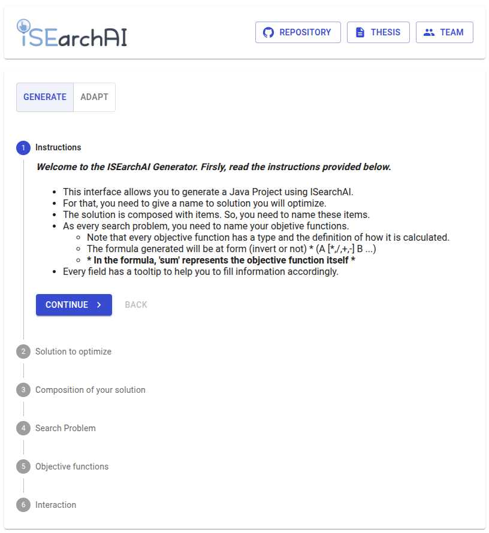
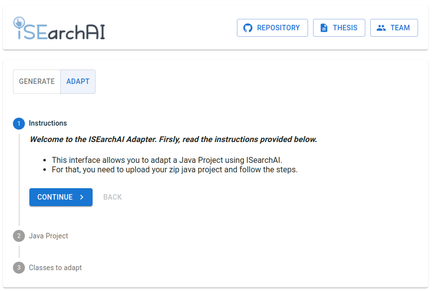

# How to use the framework

- If are getting started with a new interactive approach, you can use the ISearchAI generator to create a new java project.
- If you already have an interactive approach, you can use the ISearchAI Adapter to adapt you java project.
- If you want to programmatically implement you approach, you can add the maven dependency of the framework in your project.

### Requirements

- At least Java 8 - For implementing you interactive approach
- Maven - To manage java dependencies
- Git - To clone the project and manage your projects

### So, lets getting started

- Firstly, you need to clone the project using GIT: git clone git@github.com:iSEarchAI/isearchai.git
- Enter the folder and run "mvn clean install -DskipTests" for compiling the project

### Using the generator and the adapter frontend application

- For running the FrontEnd application, just execute "java -jar target/isearchai-1.0.0.jar" after the compilation ("mvn clean install" step)
- With this, you can generate or adapt interactive approaches using the framework.

For using the approach generator, you may access http://localhost:8080 and follow the generate steps.



For using the approach adapter, you need just to click in adapt tab and follow the instructions.

There are 4 classes needed for the framework to work. They are:
- Search Algorithm -> Solution Set -> Solution -> Element





### Coding classes

Lets explain the classes we mentioned here.

#### Search algorithm

Represented by MLSearchAlgorithm interface which has 2 methods. The first one is for training the machine learning model and the second is used for interacting with the DM.

```java
public interface MLSearchAlgorithm<T extends MLSolutionSet<S, E>, S extends MLSolution<E>, E extends MLElement> {

    /**
     * Train the model
     *
     * ISEARCHAI::EXAMPLE::{interaction.subjectiveAnalyzeAlgorithmEvaluate(solutionSet);}
     * @param solutionSet
     */
    void trainModel(T solutionSet);

    /**
     * Interact with DM
     *
     * ISEARCHAI::EXAMPLE::{return interaction.interactWithDMUpdatingInteraction(offspringPopulation, bestOfUserEvaluation, generation);}
     * @param offspringPopulation
     * @param bestOfUserEvaluation
     * @param generation
     * @return
     */
    int interactWithDM(T offspringPopulation, HashSet<S> bestOfUserEvaluation, int generation);
}

``` 

#### Solution Set